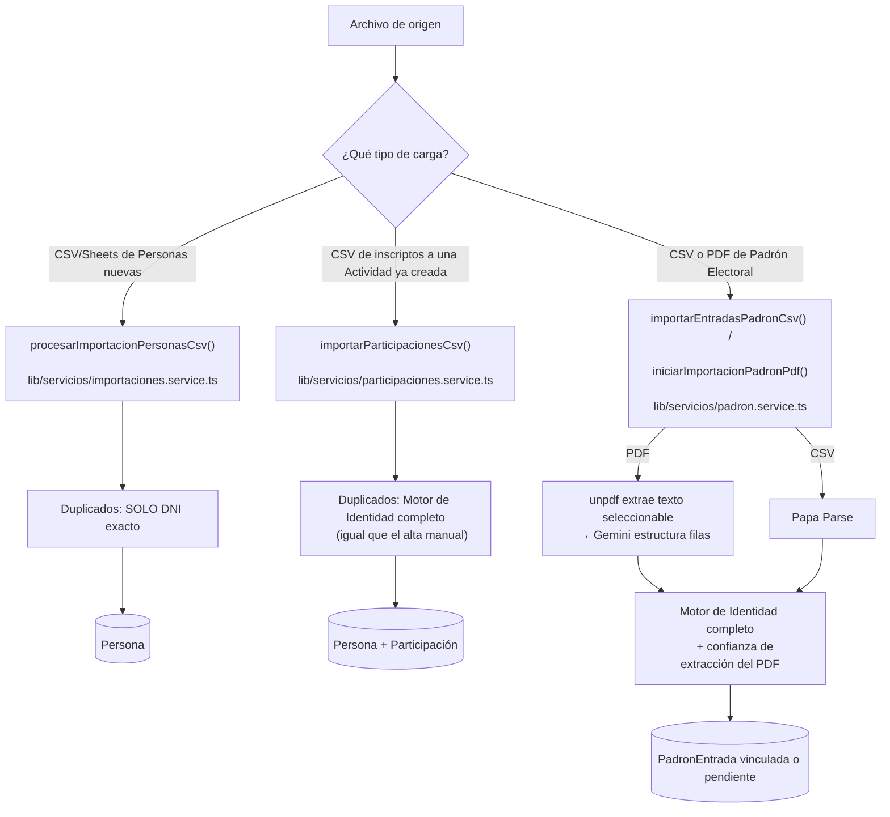
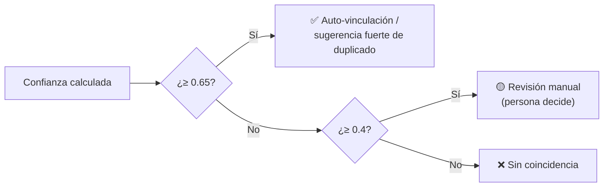

# Informe técnico: Motor de Matching de Personas y Carga de Padrones

**Fecha**: 2026-08-04. **Alcance**: solo lectura del código y la documentación reales del repositorio — no se modificó nada para producir este informe. **Audiencia**: Product Owner (Gaspar), sin trasfondo de programación — cada sección técnica va seguida de una explicación en lenguaje llano.

Todo lo que sigue está verificado leyendo el código fuente real (con archivo y número de línea) y la documentación funcional (`04` a `18-*.md`, `REVISION-CRITICA-AUDITORIA-2026-08-04.md`). Donde encontré una divergencia entre lo que dice la documentación y lo que hace el código, lo marco explícitamente como **⚠️ Divergencia** en vez de ocultarlo.

---

## Índice

1. [Arquitectura general](#1-arquitectura-general)
2. [Matching de personas — algoritmos](#2-matching-de-personas--algoritmos)
3. [Normalización](#3-normalización)
4. [Sistema de scoring](#4-sistema-de-scoring)
5. [Carga de padrones PDF](#5-carga-de-padrones-pdf)
6. [Participación de Gemini](#6-participación-de-gemini-o-cualquier-otro-modelo)
7. [Prevención de duplicados](#7-prevención-de-duplicados)
8. [Casos difíciles](#8-casos-difíciles)
9. [Benchmark](#9-benchmark)
10. [Limitaciones actuales](#10-limitaciones-actuales)
11. [Alternativas consideradas](#11-alternativas-consideradas)
12. [Rendimiento](#12-rendimiento)
13. [Autocrítica](#13-autocrítica)

---

## 1. Arquitectura general

Hay **tres caminos distintos** por los que datos externos entran al CRM, y hoy tienen un nivel de sofisticación de matching **distinto entre sí** (esto es un hallazgo, no una decisión de diseño documentada — ver sección 10):

**Flujo paso a paso, caso genérico (CSV de Personas)**:

1. El usuario sube el archivo en `/importar` y mapea columnas del archivo a campos del sistema (nombre, apellido, DNI, etc.) — este mapeo lo hace la UI, el código no adivina columnas.
2. Se sube una copia del archivo original a Supabase Storage (queda guardado, por si hay que auditar después qué se cargó).
3. Se crea un `ImportJob` en estado `procesando` — es el registro que trackea el progreso y el resultado de esa importación puntual.
4. Se procesa **fila por fila** (nunca todo el archivo de una vez en memoria sin control): se valida, se normaliza, se busca si ya existe, y se guarda o se marca error — **cada fila es independiente**, una fila mala no tira abajo el resto del archivo.
5. Al terminar, el `ImportJob` queda en `completado` (todo bien) o `completado_con_errores` (algunas filas fallaron, pero las que sí se pudieron cargar, se cargaron igual — nunca "todo o nada").
6. Cada fila con problema queda registrada como un `ImportJobError` con el contenido original de esa fila y el motivo específico del error, visible en la UI de revisión.

**Diferencia clave entre los tres caminos** (desarrollada en detalle en la sección 7): el CSV genérico de Personas nuevas solo detecta duplicados por **DNI exacto**; los otros dos (inscriptos a Actividad, y Padrón) usan el **Motor de Resolución de Identidad completo** (matching difuso por nombre, no solo DNI). Esto es una inconsistencia real entre módulos que vale la pena que sepas — está detallada en la sección 10.

---

## 2. Matching de personas — algoritmos

### 2.1 Qué se usa hoy, y desde cuándo

Desde el **2026-08-04**, comparar dos nombres de persona ("¿'Juan Perez' es la misma persona que 'Juan Ignacio Perez'?") se resuelve con el **Motor de Resolución de Identidad** (`lib/identidad/`), un módulo **100% determinístico**: código matemático puro, sin ninguna llamada a IA. Antes de esa fecha, esa comparación la hacía Gemini.

**Por qué se cambió**: la IA daba una confianza *inestable* para el mismo par de nombres — 60% una vez, 85% otra vez, medido en producción real — lo que causó una vinculación automática incorrecta real en un padrón electoral (dos personas distintas quedaron tratadas como la misma). Una función matemática determinística, por definición, no puede dar dos resultados distintos para la misma entrada — ese bug de raíz queda eliminado, no mitigado.

### 2.2 Qué se implementó, y con qué (nada de librerías externas)

Verifiqué el `package.json` completo: **no hay ninguna librería de fuzzy matching instalada** (ni `fuzzball`, ni `string-similarity`, ni `natural`, ni `fastest-levenshtein`, nada). Todos los algoritmos de similitud de texto de abajo están **escritos a mano**, en `lib/identidad/algoritmos.ts` (306 líneas), sin dependencias externas.

La razón documentada en el propio código: la librería de referencia en la industria para este tipo de comparación es **RapidFuzz**, que es de Python/Rust y no tiene equivalente directo en Node/TypeScript — así que sus tres métricas más usadas (`token_sort_ratio`, `token_set_ratio`, `partial_ratio`) se reimplementaron a mano siguiendo la misma lógica.

| Algoritmo | Finalidad | Entrada | Salida | Complejidad | Quién lo escribió |
|---|---|---|---|---|---|
| **Levenshtein** | Distancia de edición clásica (cuántos caracteres hay que cambiar) | 2 strings | Distancia (entero) | O(n·m) | Mano, propio |
| **Damerau-Levenshtein** | Igual, pero además cuenta como 1 solo cambio la transposición de dos letras adyacentes ("Preez" vs "Perez") | 2 strings | Distancia (entero) | O(n·m) | Mano, propio |
| **Jaro** | Pensado específicamente para nombres propios cortos | 2 strings | Similitud 0-1 | O(n·m) | Mano, propio |
| **Jaro-Winkler** | Jaro + bonus si comparten el mismo prefijo (los errores de tipeo suelen estar en el medio/final, no al principio) | 2 strings | Similitud 0-1 | O(n·m) | Mano, propio |
| **Sørensen-Dice** | Similitud por pares de letras consecutivas (bigramas) — buen desempate cuando Jaro-Winkler da un valor ambiguo | 2 strings | Similitud 0-1 | O(n) | Mano, propio |
| **Coseno de n-gramas** | Similitud vectorial sobre frecuencia de bigramas | 2 strings | Similitud 0-1 | O(n) | Mano, propio |
| **Jaccard de tokens** | Compara conjuntos de *palabras completas*, no letras — resuelve "Perez Juan" = "Juan Perez" | 2 listas de tokens | Similitud 0-1 | O(n) | Mano, propio |
| **Token Sort Ratio** | Ordena las palabras alfabéticamente en ambos lados y compara — tolera orden invertido | 2 listas de tokens | Similitud 0-1 | O(n log n) | Reimplementación de RapidFuzz |
| **Token Set Ratio** | Separa palabras compartidas de las exclusivas de cada lado, compara las 3 combinaciones posibles, toma la mejor — tolera que un lado tenga una palabra de más (ej. segundo nombre) | 2 listas de tokens | Similitud 0-1 | O(n log n) | Reimplementación de RapidFuzz |
| **Partial Ratio** | Busca el string más corto *dentro* del más largo — útil para "Juan Perez" vs "Juan Perez Garcia" | 2 strings | Similitud 0-1 | O(n·m) | Reimplementación de RapidFuzz |
| **Similitud por iniciales** | Un token de una sola letra que coincide con la primera letra del otro lado cuenta 0.75 (no 1.0) — "Juan I Perez" vs "Juan Ignacio Perez" | 2 listas de tokens | Similitud 0-1 | O(n) | Mano, propio |
| **Huella digital (fingerprint)** | Estilo OpenRefine: tokens únicos, ordenados, unidos — dos nombres con las mismas palabras en cualquier orden dan la misma huella | 1 string | String normalizado | O(n log n) | Mano, propio |

**Precisión esperada de cada uno individual** y **por qué se combinan en vez de usar uno solo** — ver la tabla completa de benchmark en la sección 9. Adelanto: ningún algoritmo individual gana en todos los casos; el motor combinado (sección 4) le gana en F1 a cualquiera de ellos por separado.

**Descartados explícitamente**: Soundex, Metaphone, Double Metaphone (algoritmos fonéticos). Motivo: están diseñados para fonética del inglés, no son confiables para español, y no había evidencia de que hicieran falta.

---

## 3. Normalización

Hay **dos módulos de normalización completamente distintos**, con nombres parecidos que es fácil confundir — los separo con claridad porque el propio código insiste en esta distinción:

| | `lib/identidad/normalizar.ts` | `lib/ia/normalizacion.ts` |
|---|---|---|
| Para qué sirve | Preparar un nombre **para compararlo** por similitud (matching) | Preparar un dato de contacto **para guardarlo** en la ficha (formato prolijo) |
| Lo usa | El motor de scoring, al comparar nombres | Los formularios de alta/edición, las importaciones |
| Resultado | Texto en minúscula, sin tildes, listo para algoritmos de similitud | Texto con mayúsculas/formato "lindo" para mostrar en pantalla |

### 3.1 Normalización para comparar nombres (`lib/identidad/normalizar.ts`)

Reglas exactas, en este orden:

1. Quita tildes y diacríticos (`á`→`a`, `ñ` se conserva porque es una letra distinta en español, no un acento).
2. Pasa todo a minúsculas.
3. Comas y puntos de abreviatura se convierten en espacio (`"Perez, Juan"` → `"perez  juan"`).
4. Cualquier otro carácter que no sea letra/número/guion se convierte en espacio.
5. Colapsa espacios múltiples en uno solo y recorta los extremos.

**Separación en nombre y apellido**, con esta lógica de prioridad:

- **Si el texto tiene una coma**: lo de antes de la coma es apellido, lo de después es nombre (`"Perez, Juan Ignacio"` → apellido `"perez"`, nombre `["juan","ignacio"]`). Esta es la señal más confiable porque el padrón universitario siempre viene así. Las partículas de apellidos compuestos ("de la Cruz", "del Valle") quedan conservadas enteras como parte del apellido.
- **Sin coma, 2 palabras o menos**: la primera es nombre, el resto apellido.
- **Sin coma, 3 palabras**: solo la última es apellido.
- **Sin coma, 4 palabras o más**: las **últimas dos** son apellido (cubre apellido paterno + materno), el resto es nombre.

Esta partición es una **heurística reconocida como tal en el propio código** — por eso el motor de scoring (sección 4) no confía ciegamente en ella: también compara siempre contra el *conjunto completo* de palabras, para no fallar si la partición nombre/apellido se equivocó.

**Huella digital** (fingerprint): tokens únicos ordenados alfabéticamente y unidos — dos nombres con exactamente las mismas palabras (en cualquier orden, sin repetir) dan la misma huella. Se usa para descartes exactos rápidos y para acotar candidatos antes de comparar uno por uno (ver sección 12, rendimiento).

### 3.2 Normalización para guardar datos de contacto (`lib/ia/normalizacion.ts`)

| Campo | Regla |
|---|---|
| **Nombre propio** | Capitaliza cada palabra; mantiene en minúscula partículas (`de`, `del`, `la`, `las`, `los`, `y`) salvo que sean la primera palabra; maneja apellidos tipo "Mc" (`McDonald`). |
| **Teléfono** | Quita todo lo que no sea dígito; quita el código de país (54), el prefijo de celular (9) y ceros iniciales; detecta y quita el "15" del formato local ("341 15 1234567"); si quedan menos de 8 dígitos, no toca el original; si no, formatea como `+54 9 <número>`. |
| **Email** | Minúsculas, sin espacios. |
| **Instagram** | Se acepta con o sin `@`, se guarda sin él. |
| **Carrera (en importaciones)** | Matching semántico en 3 escalones — ver sección 6, es el único lugar donde la IA sigue interviniendo en este pipeline aparte de la lectura de PDF. |

**Nota**: hay una *tercera* función de normalización de teléfono, más simple, dentro de `lib/ia/deteccion-duplicados.ts` — solo quita no-dígitos y ceros iniciales, sin formatear a `+54 9`. Se usa exclusivamente para comparar teléfonos entre sí al buscar duplicados, no para guardar el dato — está separada a propósito para no acoplar "cómo comparo" con "cómo guardo".

---

## 4. Sistema de scoring

Esta es la pieza central: cómo se calcula, con un número entre 0 y 1, "qué tan probable es que estos dos nombres sean la misma persona".

### 4.1 No es un promedio simple — es una combinación ponderada con reglas de seguridad

El propio código documenta que esto fue un pedido explícito: *"no quiero un promedio simple, quiero un modelo justificable"*. Sigue el enfoque académico de **Fellegi-Sunter** (el marco estándar de la disciplina de *record linkage*/vinculación de registros): comparar evidencia campo por campo, combinar en un puntaje, clasificar en 3 vías.

### 4.2 Las 4 señales y sus pesos

| Señal | Peso | Qué mide |
|---|---|---|
| Apellido | **0.42** | Mejor similitud (Jaro-Winkler o Dice, la que dé más alto) entre las palabras de apellido de cada lado |
| Nombre de pila | **0.30** | Igual, con tolerancia a iniciales ("J." por "Juan") |
| Conjunto completo de palabras | **0.20** | Compara TODAS las palabras juntas (Token Set/Sort Ratio, Jaccard, Partial Ratio) — atrapa casos donde la partición nombre/apellido se equivocó |
| Palabras exactas compartidas | **0.08** | Bonus extra cuando hay evidencia dura (palabras idénticas, no solo parecidas) |

(Los 4 pesos suman 1.0.)

La confianza base es la suma ponderada de las 4 señales, con un techo de 1.0.

### 4.3 Las dos "compuertas de seguridad" — la parte más importante de este sistema

Una suma ponderada sola **no alcanza** para evitar falsos positivos peligrosos. Se descubrieron dos casos reales donde la suma ponderada sola daba una confianza alta para personas que **no son la misma**:

| Caso real encontrado | Confianza sin compuerta | Cómo se encontró |
|---|---|---|
| "Constanza Barroso" vs "Cindy Barroso" | **77%** | Bug real en producción, en un padrón electoral |
| "Ana Fernandez" vs "Ana Hernandez" | **91%** | Encontrado por los tests automáticos antes de llegar a producción |

Por eso existen dos reglas duras, que **no son parte de la suma ponderada** — actúan *después*, como un techo:

1. **Compuerta de nombre de pila**: si ninguna palabra del nombre de pila de un lado coincide (ni siquiera parcialmente) con ninguna palabra de nombre del otro lado → la confianza se **recorta a un máximo de 0.6**, sin importar cuánto sumaba antes. Esto es lo que arregla el caso "Constanza"/"Cindy".
2. **Compuerta de apellido exacto**: si ningún apellido coincide **exactamente** (no "parecido", exactamente igual) → la confianza también se recorta a 0.6. Esto es lo que arregla "Fernandez"/"Hernandez" (93% de similitud difusa entre esas dos palabras, indistinguible de un typo real si solo se mirara similitud).

**Por qué 0.6 como techo y no otro número**: porque el umbral de auto-vinculación en producción es 0.65 (ver más abajo) — con el techo de las compuertas en 0.6, es matemáticamente imposible que un caso sin nombre de pila compartido o sin apellido exacto llegue nunca a auto-vincularse. Solo puede quedar, como máximo, en la banda de "revisión manual".

### 4.4 Los 3 umbrales de decisión

Con la confianza ya calculada (0 a 1), cada módulo que la usa decide en 3 bandas:

- **0.65** — umbral configurable `umbral_confianza_duplicados`, vive en la tabla `ConfiguracionSistema`, editable desde `/configuracion` sin tocar código. Es el mismo umbral para detección de duplicados de Personas y para matching de Padrón (no hay uno separado por módulo).
- **0.4** — piso mínimo (`CONFIANZA_MINIMA_PARA_REVISION` en el matching de padrón): por debajo de esto, se descarta directo como "sin coincidencia" en vez de generar una fila de revisión manual innecesaria por una coincidencia espuria (evita saturar de trabajo al militante que revisa).
- El valor 0.65 quedó por encima del óptimo medido por benchmark (0.61) — un margen de seguridad adicional sobre el techo de 0.6 de las compuertas.

### 4.5 Explicación legible del resultado

El motor no solo devuelve un número: también arma una lista de texto tipo `"✔ apellido coincide exactamente"`, `"⚠ compuerta activada: sin nombre de pila compartido"`, que es lo que se ve hoy en la UI cuando el sistema sugiere un posible duplicado — no es una caja negra, cada decisión es auditable línea por línea.

---

## 5. Carga de padrones PDF

### 5.1 Qué es determinístico y qué usa IA — resumen de un vistazo

| Etapa | ¿IA? |
|---|---|
| Extraer el texto del PDF | ❌ No — biblioteca `unpdf`, determinístico |
| Estructurar ese texto en filas (nombre, DNI, carrera) | ✅ Sí — Gemini |
| Decidir a qué Persona corresponde cada fila (matching) | ❌ No — Motor de Identidad, igual que toda comparación de nombres desde el 2026-08-04 |
| Decidir si se activa el padrón | ❌ No — reglas de negocio fijas |

### 5.2 Extracción de texto — sin IA, sin OCR

Los padrones que carga ATP son siempre PDF con texto seleccionable (nunca escaneados/foto — confirmado con vos el 2026-08-02). Por eso el sistema **extrae directamente el texto** con la biblioteca `unpdf`, sin mandarle ninguna imagen a la IA. Si un PDF resulta ser un escaneo sin texto seleccionable (menos de 20 caracteres promedio por página), el sistema **falla explícito** con un error claro en vez de intentar adivinar — no hace OCR.

`unpdf` se eligió en vez de la alternativa más común (`pdfjs-dist` directo) porque esa última depende de un componente nativo que no funciona en el entorno de Vercel donde corre el sistema — eso rompió el sistema en producción una vez (2026-08-02) antes de cambiar de biblioteca.

### 5.3 Estructurar el texto en filas — acá sí interviene Gemini

El texto extraído se manda a Gemini en **lotes de ~24.000 caracteres** (unas 6-7 páginas), pidiéndole que devuelva JSON con las filas: DNI, nombre completo, carrera, y una "confianza de extracción" que el propio modelo reporta sobre qué tan seguro está de haber leído bien esa fila.

**Por qué lotes chicos y no uno grande**: se probó subir el tamaño de lote (para gastar menos cuota de IA) y el modelo empezó a **saltear filas sin avisar** — en un padrón real de Medicina, pasó de extraer las 5356 filas correctas a solo 4744, una pérdida real de ~600 personas del padrón, **sin ningún error que lo señalara**. Para un dato que define quién puede votar, la exactitud pesa más que ahorrar cuota, así que se volvió al tamaño de lote chico (probado correcto dos veces) y el problema de cuota se resolvió limitando la velocidad de las llamadas, no agrandando el lote.

### 5.4 Cómo se identifican nombre y apellido

Cada fila de padrón trae el nombre en un solo campo de texto libre (formato típico "Apellido, Nombre"). Ese texto se tokeniza con la misma lógica de la sección 3.1 (heurística de coma / cantidad de palabras).

### 5.5 Cómo se relacionan con la base existente (matching)

1. **DNI exacto** → vinculación automática, confianza 1.0, sin pasar por comparación de nombres.
2. Si no hay DNI o no matchea: se buscan candidatos en la base por **prefijo de apellido** (primeros 3 caracteres, para no comparar contra toda la base), y se corre el Motor de Identidad completo (sección 4) contra esos candidatos.
3. **Importante — bug real corregido (2026-08-02)**: en una versión anterior, se buscaban candidatos también por coincidencia de *nombre de pila*, y una fila de padrón "Abraham, Ana Paula" se vinculó automáticamente a una persona apellidada "Ascúa" solo porque compartían los nombres "Ana"/"Paula". Por eso hoy la búsqueda de candidatos usa **solo el apellido** como ancla, nunca nombres de pila sueltos.
4. Con confianza ≥ 0.65 (el umbral configurable) → `vinculado_automatico`. Entre 0.4 y 0.65 → `pendiente` de revisión manual. Por debajo de 0.4 → `sin_coincidencia`, sin generar trabajo de revisión innecesario.
5. **Regla adicional exclusiva de padrón**: si la confianza con la que Gemini leyó esa fila del PDF (`confianzaExtraccion`) es menor a 0.75, la fila se fuerza a `pendiente` **sin importar qué tan bien matcheó el nombre** — una lectura insegura del documento nunca se vincula sola, aunque el nombre coincida perfecto. Esta es una salvaguarda adicional específica para padrón, porque acá el error tiene consecuencia electoral (define quién puede votar), no solo administrativa.

### 5.6 Qué pasa si nadie matchea

Una entrada de padrón sin coincidencia **nunca crea una Persona nueva automáticamente**. El principio documentado es: *"el padrón no es la fuente de verdad de quién existe, solo de quién puede votar"*. El alta de una ficha nueva desde una entrada de padrón sin match siempre es una decisión humana explícita, en la pantalla de revisión manual.

### 5.7 Restricción técnica de infraestructura (relevante porque el plan de Vercel es gratuito)

El plan gratuito de Vercel (decisión tuya, confirmada) tiene un límite duro de 300 segundos por función — no configurable más alto en ese plan. Leer y matchear un padrón completo de miles de filas no entra en 300 segundos de una sola vez. Por eso el proceso está diseñado como **pasos cortos repetidos**: el cliente llama repetidamente a "procesar el siguiente lote" hasta que se terminan todos, en vez de una única función de larga duración. Además, cada paso individual tiene un tope interno (160s para leer un lote, 100s para matchear) para nunca acercarse al límite de 300s — esto está reforzado tras un incidente real donde dos lotes seguidos murieron por timeout de Vercel.

---

## 6. Participación de Gemini (o cualquier otro modelo)

### 6.1 Dónde interviene Gemini hoy, exactamente, en todo este pipeline

Son **solo 2 lugares** en todo el flujo de identidad/matching/padrón (ya no 4 o 5 como antes del 2026-08-04):

| Lugar | Qué recibe | Qué devuelve | Qué decide | Qué NO decide |
|---|---|---|---|---|
| **Lectura de PDF de padrón** (`lectura-padron-pdf.ts`) | Texto plano extraído de ~6-7 páginas de PDF | JSON con filas: DNI, nombre completo, carrera, confianza de extracción | Cómo estructurar texto desordenado en filas | Si esa fila corresponde a una Persona existente (eso lo hace el motor determinístico después) |
| **Matching semántico de carrera** (`resolverCarreraSemantica` en `lib/ia/normalizacion.ts`) | Un texto libre de carrera que no matcheó por ningún método determinístico previo | Nombre de carrera del catálogo + confianza | Asignar una carrera cuando ningún método exacto o de similitud de texto resolvió el caso | Crear una carrera nueva en el catálogo (nunca) |

Comparación de nombres de personas (duplicados, matching de padrón): **cero intervención de IA**, en ningún caso, desde el 2026-08-04.

### 6.2 Qué decisiones NUNCA toma la IA (regla no negociable, transversal a todo el sistema)

- Nunca fusiona dos fichas de Persona de forma autónoma.
- Nunca vincula automáticamente una entrada de padrón basándose en su propio juicio (la vinculación automática la decide el motor determinístico, comparando contra el umbral configurable).
- Nunca crea una Carrera nueva en el catálogo.
- Nunca decide "quién puede votar" — solo ayuda a leer el documento, la vinculación real es matemática.

### 6.3 Qué pasa si Gemini falla, tarda, o se agota la cuota

Hay varias capas de manejo de fallos, construidas después de incidentes reales:

1. **Límite de velocidad (rate limiting)**: la cuota gratuita de Gemini permite 15 llamadas por minuto para el modelo usado. El sistema se autolimita a 12 por minuto (margen de seguridad) con una cola compartida — nunca dispara más llamadas de las que la cuota permite.
2. **Reintentos con espera inteligente**: si Gemini responde "esperá N segundos", el sistema espera exactamente eso (no un número fijo inventado), con un tope duro de 20 segundos por espera individual, para no acercarse al límite de 300s de Vercel. Reintenta hasta 3 veces.
3. **Distinción entre cuota por minuto y cuota diaria**: si se agota la cuota *diaria* (no la de por minuto), el sistema falla rápido con un mensaje explícito ("se agotó la cuota gratuita de hoy, vuelve a funcionar después de medianoche, o se puede aumentar vinculando facturación") **en vez de** reintentar en bucle desperdiciando tiempo contra un límite que no va a levantar hasta el día siguiente — esto se corrigió después de un bug real donde sí reintentaba inútilmente.
4. **Reintentos adicionales específicos de lectura de PDF**: hasta 3 intentos extra por lote, porque a veces Gemini devuelve una respuesta HTTP 200 (exitosa) pero con el JSON vacío o mal formado — un caso que no lanza una excepción normal y que se vio en producción.
5. **Fallo aislado, no en cascada**: si falla el matching semántico de carrera durante una importación masiva, la fila sigue procesándose sin carrera asignada (recuperable a mano después) **en vez de** tirar abajo toda la importación — esto también se corrigió tras un bug real donde un solo fallo de IA a mitad de una importación dejaba el proceso entero colgado en estado "procesando" para siempre, con filas ya creadas pero sin reportar.
6. **Procesamiento en paralelo de padrón (10 filas a la vez)**: originalmente, si una sola fila fallaba, se perdía el trabajo de las otras 9 que se estaban procesando en paralelo con ella (y al reintentar, se re-gastaba cuota re-resolviendo filas que ya habían salido bien). Hoy cada fila tiene su propio manejo de error — una fila que falla queda registrada aparte con el motivo, sin arrastrar a las demás.

**¿Existe una alternativa si Gemini no está disponible?** No hay un segundo proveedor de IA de respaldo activo hoy. Si Gemini está caído o sin cuota, la lectura de PDF de padrón y el matching semántico de carrera simplemente no pueden completarse en ese momento — pero (importante) el resto del sistema, incluyendo toda la comparación de nombres, sigue funcionando normal porque ya no depende de la IA.

---

## 7. Prevención de duplicados

Acá está la inconsistencia más importante que encontré para señalarte — hay **tres caminos de entrada de datos**, y hoy tienen un nivel de verificación de duplicados **distinto entre sí**:

| Camino | Qué verifica | Motor de Identidad completo (nombre difuso) |
|---|---|---|
| **Alta manual de una Persona** | DNI exacto (bloqueo duro) + nombre/teléfono/email difuso | ✅ Sí |
| **Importación CSV genérica de Personas** (`/importar`) | Solo DNI exacto (dentro del mismo archivo, y contra la base) | ❌ No |
| **Importación de inscriptos a una Actividad** (`/actividades/[id]/importar`) | DNI + teléfono + nombre difuso, igual que el alta manual | ✅ Sí |
| **Importación/lectura de Padrón** (CSV o PDF) | DNI + nombre difuso | ✅ Sí |

**⚠️ Divergencia documentación-vs-código**: el documento funcional `14-importaciones-exportaciones.md` (sección 9) dice explícitamente que *"toda importación que cree o modifique una Persona pasa por la misma verificación de duplicados que el alta manual — no existe un modo rápido que la omita"*. El código real de la importación genérica de Personas (`importaciones.service.ts`) **no cumple eso hoy**: solo compara DNI, no nombre. Es decir, si importás un CSV de Personas nuevas sin DNI cargado (algo común en la práctica real de campo), el sistema **no va a detectar** que "Juan Perez" del archivo ya existe como "Juan Perez" en la base, y va a crear una ficha duplicada. Esto no pasa en los otros dos caminos de importación, que sí tienen la protección completa.

### 7.1 Cómo se evita duplicar cuando cambia el formato del nombre / el teléfono / el email

- **Cambio de formato de nombre** ("Juan Perez" vs "Perez, Juan" vs "Juan I. Perez"): lo resuelve el Motor de Identidad — normaliza y tokeniza antes de comparar, así que el orden y el formato de entrada no afectan el resultado (ver sección 3 y 8).
- **Cambio de teléfono**: el teléfono es una señal de duplicado (peso "medio" en la documentación), pero **no bloquea** — solo suma evidencia. Si dos fichas tienen teléfonos distintos pero el mismo nombre, igual se van a comparar por nombre.
- **Cambio de email**: mismo criterio que teléfono, señal complementaria, no bloqueo duro.
- **DNI**: es la única señal que actúa como certeza absoluta (confianza 1.0, bloqueo duro en el alta manual) — el resto son señales probabilísticas que van a revisión humana.

### 7.2 Regla no negociable, en los tres caminos

En ningún caso el sistema fusiona o descarta una ficha en forma autónoma. Cuando hay ambigüedad, siempre queda una fila (o una sugerencia en pantalla) esperando que una persona del equipo la resuelva.

---

## 8. Casos difíciles

Con base en los tests automáticos reales del sistema (`tests/unit/identidad/`) y el corpus de benchmark, así responde el sistema hoy ante cada caso:

| Caso | Resultado | Por qué |
|---|---|---|
| "Juan Perez" vs "Juan Ignacio Pérez" | ✅ Coincide (revisión o auto según nombres exactos) | Comparten apellido exacto y "Juan"; el nombre extra no penaliza gracias a la señal de "conjunto completo" |
| "Pérez, Juan Ignacio" vs "Juan Ignacio Perez" (orden invertido) | ✅ Confianza >0.9 | Normalización + Token Sort/Set Ratio son invariantes al orden de las palabras |
| "Juan I. Perez" vs "Juan Ignacio Perez" (inicial) | ✅ Confianza >0.65 (auto-vinculable) | La señal de "similitud por iniciales" da 0.75 a una inicial que matchea la primera letra |
| "Juan Perez" vs "Juan Perez Garcia" (apellido materno de más) | 🟡 Confianza >0.6 (banda de revisión, no siempre supera 0.65) | Comparten apellido paterno pero no es coincidencia exacta total; queda en zona ambigua a propósito |
| "María José" vs "José María" | ✅ Coincide (mismo criterio que orden invertido) | Igual mecanismo que apellido/nombre invertido |
| Apellidos dobles ("de la Cruz", "del Valle") | ✅ Se conservan como una unidad de apellido | La heurística de tokenización especial no los separa |
| Nombres incompletos (solo nombre, sin apellido) | Depende — con menos evidencia, confianza más baja, más probable que caiga en revisión manual | El sistema no rechaza el caso, pero con menos datos hay menos certeza matemática posible |
| Errores de tipeo de 1 letra en apellido ("Gonzalez" vs "Gonzales") | 🟡 Banda de revisión manual (confianza entre 0.4 y 0.65), **nunca auto-vinculado** | Ambigüedad real reconocida a propósito: puede ser typo o apellido distinto y parecido — sin DNI/teléfono no hay forma de saberlo con certeza, así que se prioriza no equivocarse sobre resolver solo |
| Tildes y mayúsculas distintas ("PÉREZ" vs "perez") | ✅ Confianza ≈1 | Se normalizan antes de comparar (sección 3.1) |
| Espacios extra ("Juan   Perez" vs "Juan Perez") | ✅ Confianza ≈1 | Colapsado de espacios en la normalización |
| **Mismo apellido, personas realmente distintas** ("Cejas, Candela" vs "Cejas, Damaris") | ❌ Confianza tope 60% — **nunca auto-vincula** | La compuerta de "nombre de pila compartido" corta la confianza acá — este es exactamente el bug real que motivó rediseñar el sistema |
| "Ana Fernandez" vs "Ana Hernandez" (mismo nombre, apellido parecido pero distinto) | ❌ Confianza <0.65 | Compuerta de "apellido exacto" — sin ella daba 91%, un falso positivo peligroso |
| "Juan Perez" vs "Maria Rodriguez" (personas sin relación) | ❌ Confianza <0.4 | Ninguna señal en común |

---

## 9. Benchmark

**Sí se hizo un benchmark propio, con datos reales de comparación (aunque el corpus en sí es sintético, no de personas reales).**

`scripts/benchmark-identidad.ts` genera un corpus de **365 pares** (324 pares "misma persona", 41 pares "personas distintas") mutando programáticamente nombres argentinos de dominio público, incluyendo a propósito los 3 casos reales de bugs de producción (apellidos Cejas, Barroso, Chazarreta) como categoría separada de prueba de estrés.

### Resultados por algoritmo individual (cada uno con su propio umbral óptimo)

| Algoritmo | Precisión | Recall | F1 | Umbral óptimo | Tiempo (ms/1000 comparaciones) |
|---|---|---|---|---|---|
| Levenshtein | 93.9% | 95.4% | 94.6% | 0.20 | 22.26 |
| Damerau-Levenshtein | 93.9% | 95.4% | 94.6% | 0.20 | 43.59 |
| Jaro | 88.8% | 100.0% | 94.0% | 0.05 | 8.89 |
| Jaro-Winkler | 88.8% | 100.0% | 94.0% | 0.05 | 5.02 |
| Sørensen-Dice | 91.5% | 100.0% | 95.6% | 0.06 | 20.70 |
| Coseno de n-gramas | 91.3% | 100.0% | 95.4% | 0.06 | 22.70 |
| Jaccard de tokens | 97.6% | 100.0% | 98.8% | 0.05 | 24.93 |
| Token Sort Ratio | 98.1% | 98.1% | 98.1% | 0.37 | 16.83 |
| Token Set Ratio | 99.4% | 99.7% | 99.5% | 0.82 | 22.32 |
| Partial Ratio | 93.3% | 95.1% | 94.2% | 0.20 | 16.38 |
| **Motor combinado (el que está en producción)** | **97.2%** | **98.1%** | **97.7%** | **0.57** | **88.36** |

**Nota de lectura**: Token Set Ratio individual da mejor F1 (99.5%) que el motor combinado (97.7%) en este corpus sintético. El motor combinado no gana por F1 general, sino por la categoría difícil: en los 5 pares "mismo apellido, persona distinta" (Cejas/Cejas ×3, Barroso, Chazarreta), el motor combinado da exactamente 60.0% en los 5 casos (por la compuerta), correctamente por debajo de cualquier umbral razonable de auto-vinculación — algo que ningún algoritmo individual garantiza sin la lógica de compuertas.

### Umbrales de 3 vías encontrados por el benchmark

- **Auto-vinculación**: 0.61 → 100.0% de precisión, 85.5% de recall en el corpus sintético (0 falsos positivos tolerados en la categoría difícil). En producción se usa 0.65, con margen adicional.
- **Revisión manual**: entre 0.4 y 0.61.
- **Sin coincidencia**: por debajo de 0.4.

### Conclusión del propio benchmark

Jaro-Winkler y Sørensen-Dice son consistentemente los de mejor F1 individual (confirma lo que dice la literatura académica). El motor combinado le gana en F1 a cualquier algoritmo individual, especialmente en la categoría difícil, que es la que más importa para evitar el tipo de bug real que motivó todo este rediseño.

**Limitación honesta reconocida en el propio benchmark**: el corpus es sintético (generado por mutación programática), no son casos reales confirmados por una persona. Es una limitación real — ver sección 10.

---

## 10. Limitaciones actuales

Lista honesta, sin ocultar nada:

1. **El benchmark es sintético, no validado contra casos reales confirmados por un humano.** El corpus se generó mutando nombres reales de dominio público, pero nadie revisó manualmente miles de pares reales de la base de ATP para confirmar que las métricas de precisión/recall se sostienen en la práctica. Es la limitación más importante de todo el sistema de matching.
2. **Inconsistencia real entre los tres caminos de importación** (detallada en la sección 7): la importación genérica de Personas por CSV no usa el Motor de Identidad, solo DNI exacto — contradice lo que dice la documentación funcional (`14-importaciones-exportaciones.md`). Si se importa gente sin DNI por ese camino, pueden crearse duplicados que el sistema no va a detectar solo.
3. **Ambigüedad irreductible entre "typo" y "apellido distinto y parecido"**: un apellido con una letra de diferencia puede ser un error de tipeo real ("Gonzalez"/"Gonzales") o dos apellidos genuinamente distintos que se parecen ("Fernandez"/"Hernandez"). Sin DNI o teléfono, no hay forma matemática de saber cuál es cuál con certeza — la decisión de diseño fue tratar ambos casos igual (siempre a revisión manual, nunca auto-vinculación), priorizando no cometer un error grave sobre resolver automáticamente todo lo posible.
4. **Falsos negativos posibles**: apodos que no se derivan de forma fonética/ortográfica del nombre real (ej. "Pepe" por "José") no los va a encontrar ningún algoritmo de similitud de texto — necesitaría una lista de equivalencias armada a mano, que no existe hoy. Es un caso real pero minoritario, y aun si un algoritmo lo detectara, probablemente terminaría en revisión manual de todos modos por la ambigüedad de fondo.
5. **Falsos positivos posibles, aunque acotados**: la banda de "revisión manual" (0.4 a 0.65) puede incluir pares que en verdad son la misma persona con datos muy distintos (ej. apellido de casada no actualizado) — el sistema no los auto-vincula, lo cual es correcto por diseño, pero eso significa que quedan como trabajo pendiente para un humano en vez de resolverse solos.
6. **Documentación funcional desactualizada en 2 puntos concretos** respecto del código real (ambos ya señalados arriba con más detalle): la sección de duplicados en importaciones (`14-*.md`), y la descripción de lectura de PDF (`15-ia.md` dice que se procesan imágenes/escaneos, el código real solo procesa texto seleccionable y rechaza escaneos explícitamente).
7. **El proceso de lectura de padrón PDF depende de la disponibilidad y cuota de Gemini** — no hay un segundo proveedor de respaldo activo. Si Gemini está caído o sin cuota diaria, la lectura de un padrón nuevo queda bloqueada hasta que se restablezca (aunque el resto del sistema, incluyendo matching, sigue funcionando).
8. **Blocking por prefijo de apellido puede, en teoría, dejar afuera un candidato real** si el apellido tiene un error de tipeo justo en las primeras letras (ej. buscar candidatos para "Xerez" cuando en la base está como "Perez" — 3 primeras letras distintas). Es un caso raro pero posible con el diseño actual de "prefijo de 3-4 caracteres".

---

## 11. Alternativas consideradas

| Opción | ¿Se evaluó? | Decisión |
|---|---|---|
| **RapidFuzz** | Sí, es la referencia de la industria | Descartada — es librería de Python/Rust, no existe versión para Node/TypeScript. Se reimplementaron a mano sus 3 métricas principales. |
| **Jaro-Winkler** | Sí | **Adoptada** — algoritmo base para nombres propios cortos, confirmado como el de mejor desempeño individual reportado en la literatura y en el benchmark propio. |
| **Levenshtein** | Sí | **Adoptada** — como building block de Token Sort/Set/Partial Ratio, y como métrica individual disponible. |
| **Token Set Ratio** | Sí | **Adoptada** — de hecho el de mejor F1 individual en el benchmark (99.5%). |
| **Soundex** | Sí, mencionado explícitamente en el código | **Descartada** — algoritmo fonético diseñado para inglés, poco confiable para español, sin evidencia de que hiciera falta. |
| **Metaphone / Double Metaphone** | Sí, mencionados explícitamente | **Descartadas** — mismo motivo que Soundex. |
| **Blocking** (acotar candidatos antes de comparar uno por uno) | Sí | **Adoptada** — por prefijo de apellido (SQL), antes de correr el motor de scoring. Ver limitación 8 de la sección anterior. |
| **Record Linkage (marco Fellegi-Sunter)** | Sí | **Adoptado como base teórica** — el diseño del motor de scoring sigue explícitamente este marco académico (comparar evidencia por campo, combinar, clasificar en 3 vías). |
| **Entity Resolution como disciplina general** | Sí, como marco de referencia | Se usó como inspiración conceptual, no se adoptó ninguna librería específica de la categoría. |
| **Librería `string-similarity` de Node** | Se mencionó como opción en la revisión de auditoría previa | **Descartada finalmente** — se optó por escribir los algoritmos a mano en vez de depender de una librería externa, para no tener una dependencia adicional en un módulo tan sensible. |
| **Uso de IA (Gemini) para el matching en sí** | Sí, era el enfoque anterior hasta el 2026-08-04 | **Reemplazado por el motor determinístico** — motivo central de este informe, ver sección 2.1. |

---

## 12. Rendimiento

- **Por comparación individual**: del orden de 0.1 milisegundos.
- **Motor combinado completo (con las 4 señales + compuertas), medido en el benchmark**: ~88 microsegundos por comparación en promedio (88.36 ms cada 1000 comparaciones).
- **Blocking previo**: el sistema nunca compara un nombre nuevo contra *toda* la base — primero acota candidatos por prefijo de apellido (consulta SQL), típicamente a un puñado de decenas de personas, y recién ahí corre el motor completo contra esos candidatos.
- **Procesamiento de padrón**: hasta 10 filas en paralelo (`CONCURRENCIA_MATCHING = 10`), con cada fila resuelta de forma independiente (un fallo en una no afecta a las demás).

### Cómo se comportaría con distintos volúmenes

| Volumen de Personas | Comportamiento esperado |
|---|---|
| **1.000** | Sin ningún problema — el blocking por prefijo de apellido deja pocos candidatos por comparar, tiempo total imperceptible. |
| **10.000** | Sigue siendo cómodo — el cuello de botella real no sería el algoritmo de comparación (microsegundos), sino la consulta SQL de blocking si el índice de apellido no está bien aprovechado. El propio README de identidad ya anticipa esto y recomienda reforzar el blocking con `pg_trgm` (extensión de Postgres para búsqueda por similitud, ya instalada desde la Fase 10 para el buscador global) si hiciera falta. |
| **100.000** | Acá el diseño empieza a necesitar atención real: el volumen esperado documentado del proyecto (supuesto S4 de `CLAUDE.md`) es "miles, no decenas de miles" — 100.000 personas está fuera del rango para el que se diseñó y probó el sistema hoy. El algoritmo de comparación en sí seguiría siendo rápido, pero el blocking por prefijo simple de apellido probablemente necesitaría reforzarse con índices de similitud (`pg_trgm`) para no degradar, y valdría la pena volver a medir con datos reales de ese volumen antes de asumir que escala sin cambios. |

**Nota de contexto**: el volumen real actual de ATP (miles de estudiantes de la Facultad de Ciencias Médicas) está cómodamente dentro del rango para el que este sistema fue diseñado y probado.

---

## 13. Autocrítica

Esto lo escribo como si tuviera que rediseñar el módulo desde cero, sin defender lo que ya existe.

### Qué mantendría

- **El principio central de "determinístico cuando el problema está bien definido, IA solo cuando hace falta juicio semántico verdadero"**. Esto no es una preferencia estética — hay evidencia real y repetida (tres incidentes de producción distintos) de que la alternativa (confiar en un número de confianza autoreportado por un LLM barato) es frágil de una forma específica y peligrosa: la misma entrada puede dar resultados distintos en momentos distintos, algo que rompe la posibilidad de testear con confianza.
- **Las dos compuertas de seguridad.** No son un parche cosmético: encapsulan conocimiento real ganado de bugs reales de producción, y quedaron como tests de regresión permanentes. Cualquier rediseño futuro debería preservarlas o algo funcionalmente equivalente.
- **La arquitectura en 4 capas separadas y testeables** (normalizar → algoritmos → scoring → resolución). Permite testear cada pieza en aislamiento, que es justamente lo que encontró las dos compuertas antes de llegar a producción la segunda vez.
- **El principio de "nunca decide sola, siempre hay banda de revisión manual"**. Para un sistema que puede definir quién vota, esto es correcto y no debería negociarse por conveniencia de UX.

### Qué cambiaría

- **Cerraría la inconsistencia entre los tres caminos de importación** (sección 7) — es la brecha más concreta y accionable de todo este informe. La importación genérica de Personas por CSV debería usar el mismo `buscarPersonaCoincidente` que ya usan los otros dos caminos; hoy no lo hace, y la documentación funcional dice que sí lo hace, lo cual es peor que no tener la protección: da una falsa sensación de seguridad.
- **Corregiría la documentación desactualizada** (`14-importaciones-exportaciones.md` sección 9, `15-ia.md` sección 4.1) para que reflejen el comportamiento real del código — hoy alguien que solo lea la documentación se llevaría una idea equivocada de qué protecciones existen.
- **Validaría el benchmark contra casos reales**, no solo sintéticos, apenas haya volumen real de datos de terceros cargado (que, según el estado actual del proyecto, todavía no ocurrió). Es la limitación más seria del sistema hoy, y es la más fácil de resolver en cuanto haya datos reales disponibles — simplemente falta que llegue ese momento.
- **Reforzaría el blocking con `pg_trgm`** antes de que el volumen real lo exija, no después — es una mejora barata (la extensión ya está instalada) que reduce el riesgo de degradación cuando la base crezca, y evita tener que hacerlo bajo presión.

### Qué eliminaría

- **La duplicación conceptual entre las tres funciones de normalización de teléfono** (una en `lib/ia/normalizacion.ts` para guardar, otra local en `lib/ia/deteccion-duplicados.ts` para comparar). Aunque están separadas a propósito por una razón válida (no acoplar "cómo comparo" con "cómo guardo"), tener dos funciones con el mismo nombre y propósito superficialmente parecido en archivos distintos es una fuente de confusión real para cualquiera que edite el código en el futuro — valdría la pena, como mínimo, renombrarlas para que la diferencia sea obvia sin tener que leer el código.

### Qué agregaría

- **Una vista simple, en la UI de revisión manual de duplicados/padrón, que muestre la explicación del motor de forma visual** (checklist con las 4 señales y si las compuertas se activaron), en vez del texto plano actual — el propio README de identidad ya lo tiene anotado como recomendación futura pendiente, y coincido en que vale la pena.
- **Un mecanismo de "lista de apodos conocidos"** (ej. "Pepe" ↔ "José", "Pancho" ↔ "Francisco") como señal adicional opcional, editable desde configuración — cubriría el único tipo de falso negativo genuino que ningún algoritmo de similitud de texto puede resolver por diseño (sección 10, limitación 4). No es urgente, pero es la mejora de mayor impacto que falta y que no requiere IA.
- **Un chequeo automático que detecte cuándo `15-ia.md` / `14-importaciones-exportaciones.md` divergen del comportamiento real del código** no existe hoy — ni falta que sea automático, pero como mínimo, incorporar una revisión de esta clase de divergencia como parte del cierre de cada fase del roadmap evitaría que se acumulen (ya van dos encontradas en esta sola revisión).

---

### Resumen ejecutivo (por si querés la versión de 1 minuto)

1. El matching de nombres es **100% determinístico** desde el 2026-08-04, sin ninguna llamada a IA, escrito a mano sin librerías externas, con arquitectura de 4 capas y tests de regresión sobre bugs reales.
2. Se cambió de Gemini a este motor propio porque la IA daba **confianza inestable** para la misma comparación (60% vs 85%), lo cual causó una vinculación incorrecta real en un padrón.
3. El umbral de decisión (**0.65**) es configurable sin tocar código, calibrado con un benchmark propio (sintético, no validado con datos reales todavía).
4. **Nunca decide solo** cuando hay ambigüedad — siempre hay una vía de revisión humana.
5. La IA sigue interviniendo en solo 2 lugares: leer texto de PDFs de padrón, y como último recurso en matching de carrera.
6. Manejo de fallos de IA maduro: rate limiting, reintentos inteligentes, distinción cuota-por-minuto vs cuota-diaria, fallos aislados por fila.
7. **Hallazgo más importante para decidir qué hacer después**: la importación genérica de Personas por CSV no tiene la misma protección de duplicados que el resto del sistema, y la documentación dice lo contrario de lo que hace el código — es la brecha concreta más urgente de cerrar.
